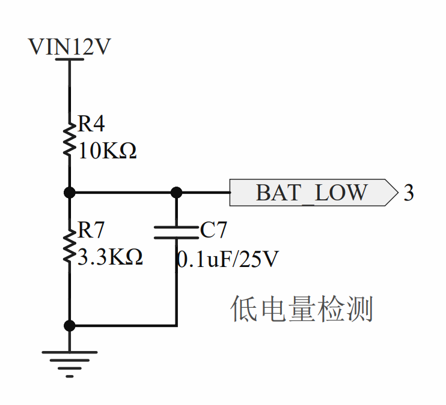
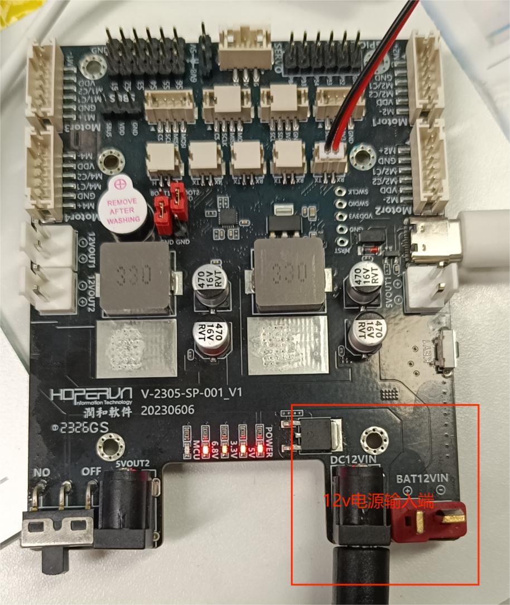

## SLHSP104_AT32板卡检测电池电量

### 原理

锂电池的电压和电量几乎为线性变化，所以可以通过采集电压值成比例转化为电量值。

PC0引脚检测电池adc值





2.最低电压为xV，最高电压yV，则经过分压电路，AD端输出的电压范围为`3.3x/(10+3.3) ~ 3.3y/(3.3+10)`

板卡电量检测分压电路设计，上面两个电阻大小分别为3.3k和10k.

 
```
//电池最低电压
#define BATTERY_FULL_VOL          12.6f

//电池最高电压
#define BATTERY_LACK_VOL          10.5f

// BATTERY_SCALE_FACTOR是（3.3+10）/3.3
// 由硬件分压电路决定,上面两个电阻大小分别为3.3k和10k
#define BATTERY_SCALE_FACTOR     (13.3f / 3.3f)

最后电量百分比
(100.0 * (AD值 * 3.3f / 4096 * BATTERY_SCALE_FACTOR - BATTERY_LACK_VOL) / (BATTERY_FULL_VOL - BATTERY_LACK_VOL))
```
